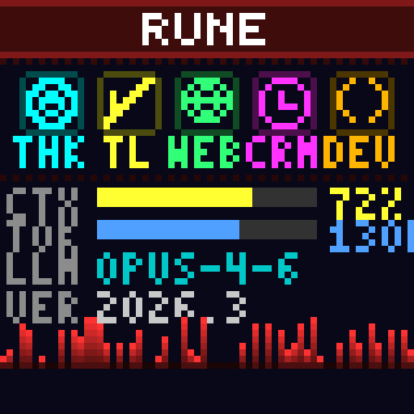

# OpenClaw-Pixoo

Arcade-style agent activity display for the Divoom Pixoo-64 LED panel.

Shows real-time AI agent status: what it's thinking, which tools it's using, context usage, token counts, and a scrolling activity pulse.



## Features

- **Activity Icons** — Thinking, Tool, Web, Cron, Dev — light up in neon colors when active
- **Stats Bars** — Context usage (CTX), total tokens (TOK), model name (LLM), version (VER)
- **Scrolling Pulse** — Activity history bar chart that grows with agent work and decays when idle
- **Live Monitoring** — Watches OpenClaw session logs and updates the display in real-time
- **Pixel Art Renderer** — Custom 3x5 and 4x5 bitmap fonts, 8x8 icons, all rendered in code

## Requirements

- Python 3.8+
- Divoom Pixoo-64 on the same network
- No pip dependencies (uses only stdlib + curl)

## Quick Start

```bash
# Single test frame
python3 pixoo_display.py 192.168.178.190 RUNE "#FF3030"

# Live activity monitor
python3 activity_monitor.py --name RUNE --color "#FF3030" --ip 192.168.178.190

# Demo mode (cycles through activity states)
python3 activity_monitor.py --demo
```

## Monitor Options

```
--ip IP            Pixoo IP address (default: 192.168.178.190)
--name NAME        Agent name displayed in title bar
--color HEX        Agent color as hex (e.g. "#FF3030" for red)
--interval SECS    Update interval in seconds (default: 1.0)
--brightness 0-100 Display brightness (default: 80)
--stats-interval S How often to refresh stats from OpenClaw (default: 30)
--log-dir PATH     OpenClaw session log directory
```

## Multi-Agent Setup

Run one monitor per agent host, each with a different name and color:

```bash
# On Rune (red)
python3 activity_monitor.py --name RUNE --color "#FF3030"

# On Colossus (green)
python3 activity_monitor.py --name COLOSSUS --color "#30FF30"
```

## Display Layout (64x64)

```
┌────────────────────────────────────┐
│           RUNE (title)             │  y=0-8
├╌╌╌╌╌╌╌╌╌╌╌╌╌╌╌╌╌╌╌╌╌╌╌╌╌╌╌╌╌╌╌╌╌╌┤  y=9
│  🧠  🔧  🌐  ⏰  💻  (icons)     │  y=12-19
│  THK  TL  WEB CRN DEV (labels)    │  y=21-25
├╌╌╌╌╌╌╌╌╌╌╌╌╌╌╌╌╌╌╌╌╌╌╌╌╌╌╌╌╌╌╌╌╌╌┤  y=27
│  CTX [████████░░░░] 72%            │  y=29
│  TOK [██████░░░░░░] 130K           │  y=34
│  LLM opus-4-6                      │  y=39
│  VER 2026.3.2                      │  y=45
│                                    │
│  ▁▃▅▇▅▃▁ ▁▃▅▃▁  (pulse)           │  y=56
└────────────────────────────────────┘
```

## Pixoo API Notes

**Critical: Sequential PicIDs required.** The Pixoo silently ignores frames with non-sequential PicIDs. Always query `Draw/GetHttpGifId` first, then send with `current_id + 1`.

```python
# ✅ Correct
current = query("Draw/GetHttpGifId")["PicId"]
send(PicID=current + 1)

# ❌ Wrong — silently ignored
send(PicID=1)
send(PicID=random())
```

**Other gotchas:**
- `Draw/ResetHttpGifId` crashes the Pixoo firmware — never use it
- Channel 3 is the custom/API draw channel
- Use `curl` subprocess for HTTP — Python's `urllib` silently fails on large payloads
- The Pixoo persists the last frame to flash (survives reboots)
- Re-assert `Channel/SetIndex` periodically if the Pixoo auto-reverts to clock

## License

MIT
